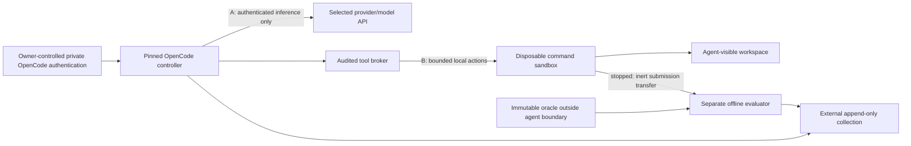

# Level 1 runtime architecture — review proposal

Status: **design only**. No sandbox, broker, OpenCode adapter, inference relay or
runner is implemented here. Review this boundary before implementation. Both tracks
evaluate OpenCode + model + provider + declared runtime, never intrinsic model
intelligence. OS isolation is required even for restricted scored execution.

## Tracks and interpretation

| Track | Allowed model actions | Test execution | Current status |
| --- | --- | --- | --- |
| `restricted` | Read/search/edit workspace, reasoning and clarification | External harness only | Secret-free no-shell provider profiles implemented; isolated runtime and harness pending |
| `agentic` | Restricted actions plus local Python, pytest, `git status`, `git diff` and predeclared development commands | Agent can invoke public tests; evaluator runs immutable checks afterward | Architecture only; no executable profile or sandbox |

Restricted results deliberately omit much of the TP's local software-development
workflow. Track is a blocking factor, not a nuisance variable to pool away. An
agentic tool adapter changes the evaluated system and must have its own version,
checksum, action semantics and explicit limitations. No unrestricted shell is
enabled on the maintainer host. Neither track may access hidden evaluation.

## Trust and process boundaries

Treat model outputs, shell strings, submitted Python/tests, Git files, symlinks,
filenames, tool arguments and prompt injection as untrusted. Assume arbitrary code
execution in the disposable command environment. Trusted components are the pinned
OpenCode controller, narrowly audited tool broker, runtime supervisor, event
collector and external evaluator controller. Kernel/hypervisor escape, controller
vulnerabilities and malicious provider responses remain residual risks.

**A: inference path.** Only the controller may use the owner's OpenCode-managed
persistent credential for the fixed provider ID. Authentication storage is private,
opaque, not discovered/copied by benchmark code. The owner must approve the future
runtime's provisioning mechanism. A dedicated private controller identity may use
owner-managed OpenCode state; task commands cannot mount or inspect it. Only the
selected endpoint and justified transport dependencies may be reachable. Record
all inference, including auxiliary calls; disable them or use the same cell.

**B: command path.** Every model-controlled executable action runs in a separate
network/PID/mount/user boundary with no external network, host loopback, DNS,
metadata service, controller Unix socket, inherited proxy settings or credential
values. Python's socket/HTTP libraries are blocked by OS policy too. The guest
receives neither an authenticated inference socket nor a general-purpose proxy.
A path-filtered shell command on the controller is insufficient.

All file tools must also be mediated or confined to the agent boundary. Wrapping
`bash` alone leaves read/edit/search and alternate execution routes exposed.
The controller sees a trusted project-config copy; it must not load new tools,
plugins, Git hooks, instructions or config from arbitrary agent changes. Any
adapter code is immutable trusted runtime material outside agent-editable paths.

## Filesystem and command environment

The sole visible project is the generated workspace: `toolbox.py`, source public
tests, selected `opencode.json`, isolated `.git`, and declared agent-created files
such as task `AGENTS.md`. Minimal read-only OS/Python/pytest/Git runtime files and
an empty disposable temporary directory are necessary infrastructure, not extra
repositories. No host home, benchmark root, reference materials, oracle, evaluator,
other runs, catalogs, prompt metadata, expected patches or container-engine socket
is mounted. Do not bind a parent directory for convenience.

The broker resolves paths beneath the workspace, rejects traversal and escaping
symlinks, handles file replacement without following links, and bounds responses.
Do not expose host `/proc`, inherited descriptors or processes. Separate UIDs and
PID namespaces prevent command inspection of the controller. The controller's
credential store, broker control channel and collector channel have no guest path
or accessible descriptor. Configuration/tool entry points are immutable; guest
Git is local and has no remotes, inherited config, template hooks or credential
helpers. Python and pytest packages are preinstalled: no package installation or
network dependency resolution during runs. CPU, memory, disk, processes, command
output and time limits are frozen in the campaign, not tuned after outcomes.

## Tool integration and native commands: unresolved gate

Current [OpenCode custom-tool documentation](https://opencode.ai/docs/custom-tools/)
describes built-in name overrides. This suggests a broker adapter without replacing
the OpenCode reasoning loop; it does not prove compatibility with the release
selected for a campaign. Check every execution/file route on that exact release.
Any trusted adapter is an explicit exception to disabled arbitrary plugins/tools,
installed by the supervisor and recorded as part of the fixed environment.

Native `/init` and `/undo` may use controller filesystem/Git paths independently
of ordinary tool calls. Their complete paths and rollback semantics need a pinned
source/runtime audit. If they cannot operate safely through this boundary, publish
them as unavailable in that track or revise the architecture before implementation.
Do not emulate native undo with a harness reset or silently permit controller-side
shell. The controller must never execute agent-modified hooks or generated tests.

## Technology options for review

| Option | Benefit | Limit / decision needed |
| --- | --- | --- |
| Linux namespaces with [bubblewrap](https://github.com/containers/bubblewrap) | Explicit minimal filesystem and network namespace construction | Shared host kernel; policy, resource limits and broker separation remain our responsibility |
| Rootless container around commands | Familiar image/dependency packaging | Image isolation alone does not separate credential-bearing controller from commands; never expose engine sockets or host mounts |
| Separate command [Firecracker microVM](https://firecracker-microvm.github.io/) | Virtualization boundary around untrusted execution | More operational complexity; guest images, control channels and KVM availability need validation |

These are evaluated options, not selected implementations. A whole OpenCode process
sharing a container/UID with its commands fails the credential boundary. A guest
with unrestricted Internet plus a command-name blacklist fails the network boundary.
Prefer a minimal auditable design after reviewing feasibility and release-specific
tool/native-command behavior. No containment guarantee is asserted before testing.

## Evaluator and collection boundary

Stop all agent/controller execution before collecting the final patch and new
files. The trusted supervisor exports inert regular-file contents with path, size,
mode and hash checks; reject escaping links/special files. Never invoke submitted
code on the collector host. Raw events and timestamps are retained outside agent
control, with credential/authorization fields excluded and human redaction review.

Run submitted code only in a fresh offline evaluator sandbox, with immutable oracle
and restored public checks. The evaluator has no provider credential or maintainer
mounts; submitted code is still untrusted there. Hidden test code and detailed
reports never return to the agent. The toy submission-root oracle interface is
implemented, but this safe execution/collection harness is not.

## Acceptance tests before owner preflight

1. Deny host/parent/oracle/evaluator/reference access, symlink and `/proc` escapes,
   inherited descriptors, credential sources and controller/broker socket access.
2. Deny command-side HTTP, DNS, raw sockets, localhost, metadata and direct/proxied
   inference access; allow controller-side inference only to the selected provider.
3. Allow public pytest, Python and declared local Git operations inside the guest;
   verify bounded resources and disposal without host effects.
4. Audit effective configuration and all tool routes; reject fallback models,
   agent-added tools/plugins and automatic updates.
5. Verify native commands separately; prove immutable logging/evaluation and no
   hidden feedback. Test attacks in a synthetic non-scored fixture, not toy answers.

Remaining limits include kernel/hypervisor vulnerabilities, unsafe trusted adapter
code, provider-side retention/drift, inability to attest hosted weights, public
oracle contamination, and imperfect native-command/tool equivalence. Architecture
review, owner-controlled authentication provisioning and exact release selection
remain blockers. Implementation stops here.
